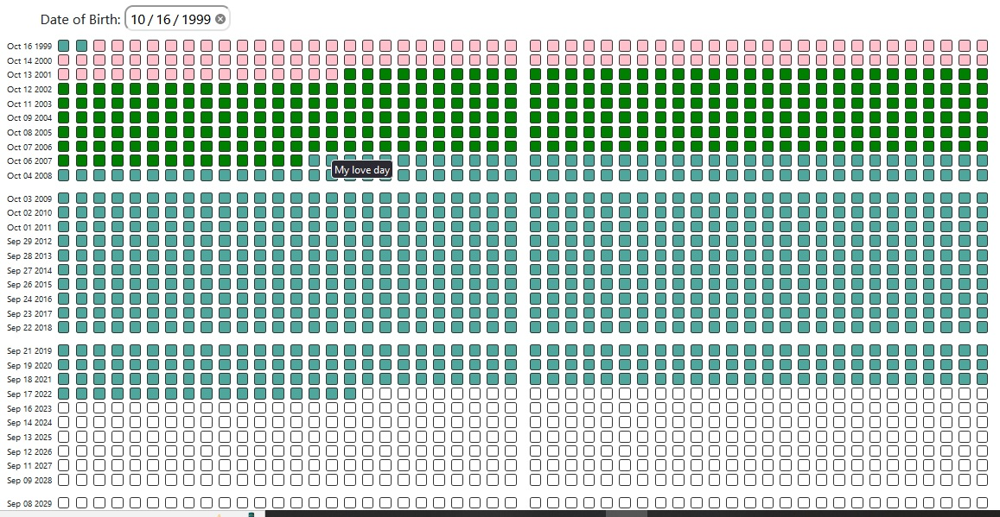

# momento-mori-calender

Your life is made up of 4160 weeks, and this tool will help you make the most of them.

Fill in a new square with each passing week, and you'll quickly experience improved focus, a heightened perspective on life, and a rush of motivation to take consistent action

# UI Design

Momento Mori Calender Design Prototype and specification, click to [view][momento-mori-design].



# Installation

Momento Mori is available as an [npm package][npm-home].

```bash
npm i momento-mori-calender --save
```

or if you prefer Yarn

```bash
yarn add momento-mori-calender
```


# Props

## 1. yearLabel

An array of years that should be shown on the right side of the calendar


## 2. dateOfBirth

The user's date of birth, in the format of "YYYY-MM-DD"


## 3. showDateInput

A boolean that determines whether or not the date of birth input should be shown

## 4. events

 An array of events to be highlighted on the calendar

## 5. showStartingOfYear 

A boolean that determines whether or not the starting of each year should be indicated on the calendar

# Usage

Here's a simple example

```jsx
import MomentoMoriCalendar from './MomentoMoriCalendar';

const App = () => {
  return (
    <MomentoMoriCalendar 
      yearLabel={[2020, 2021, 2022]}
      dateOfBirth={"1999-10-16"}
      events={[
        {
          startingDate: "2021-07-01",
          endDate: "2021-07-07",
          color: "red",
          description: "Vacation to Hawaii"
        },
        {
          startingDate: "2022-02-14",
          endDate: "2022-02-15",
          color: "pink",
          description: "Valentine's Day"
        }
      ]}
      showDateInput={true}
      showStartingOfYear={true}
    />
  );
}

```

[npm-home]: https://www.npmjs.com/package/momento-mori-calender
[momento-mori-design]: https://momento-mori-calender.netlify.app/
